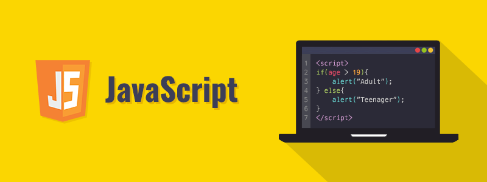

# CURSO GRATIS DE PROGRAMACION BASICA PLATZI.

## Recap Programación básica. 

### La creacion de aplicaciones web se basan en 3 pilares: que son HTML, CCS, JavaScrip.

- HTML (.html) es todo el contenido de l página web, aqui es donde se desarrollará la información.
- CCS (.css) es donde se define el diseno y todo lo que tiene que ver con los visual en la página web.
- JavaScript (.js) es el lenuaje de programacion que se utliza para el desarrollo de la dinámica de la página web.

**Todos los lenguajes de programación trabajan con varios elementos como: arreglos, variables, condicionales, funciones y clases. Cada una de ellas tiene propositos importantes en el lenguaje de programación.**

## Mi Primera linea de código.

### alert("Mi nombre es Ángel");

**Para empezar a aprender JS solo tenemos que aprende lo básico, que unas de ella son las variables, es un espacio que se crea para guardar una información.** 

## ¿Qué es HTML/CSS/JS?

**HTML, CSS y JavaScript son los tres lenguajes que están en el centro de crear aplicaciones web por tal razón, habalaremos de ellos:**

- HTML no es un lenguaje de promagramción, en HTML es donde vamos a encontrar toda la información de nuestra página web.
- CCS tampoco es un lenguaje de programación, en este es donde vemos el diseño de nuestra página, todo lo relativo con los visual esta relacionado con CSS, ni en JS ni en HTML tienen que ver con eso.
- JavaScrip es un lenguaje de programación que tiene interactividad, es cuando desarrollamos código para que nuestros dispositivos hagan algo. 

**El Browser (Navegador) es el que toma todo los códigos y etiquetas y los interpreta y organiza y podemos ver todo lo que hemos creado.**

## JavaScript no es Java.

**JS y Java no es lo mismo, son dos cosas muy diferentes, entre ellas están:**

**Java**
  - Es de Oracle.
  - Es creado para servidores.
  - Lenguaje pensado para crear aplicaciones de escritorio.
  - Es muy popular en bancos.
  - Es donde se crea aplicacones para android.

**JavaScript**
  - JavaScript es el lenguaje de la web, servidores, robots, etc.

## Primeros pasos en el navegador con alert.

- Alert es la forma que mandamos un mensaje, muestra información o resultados en la pantalla. También muestra advertencias.
- Para poner una alerta se pone la palabra especifica "Alert", seguida de dos commilas y dentro de ellas el texto ue queremos que aparezca. Cerramos con punto y coma.
- Para declarar una variable, solo tenemos que poner la palabra "var", luego pones el nombre de esa variable, el operador de asignación y luego su valor. Cerramos con punto y coma.
- Las comillas se utilizan para limitar textos, porque son datos tipo string.

## HTML, CSS, JavaScript de verdad.

- Muy importantes las reglas para nombrar variables en JavaScript:

- No pueden empezar con números, sólo con letras.
- Se diferencian mayúsculas y minúsculas.
- No se pueden utilizar caracteres "raros" como ñ o tildes.
- Para poner nombres largos se utlizanan la rayita baja.

**Con este ejemplo se pudo experimentar con HTML, CSS y JS, asi como:**

- Nuevas etiquetas de HTML.
- Nuevas etiquetas CCS.
- Codigos jS.
- Se abre una etiqueta co un nombre, y se cierra con el mismo nombre pero con el slash al final, admas se le agrega los simblos de mayor y menor en sus extremos.
- El JavaScritp se pone el el body, y se abre una etiqueta llamada script.
- El CCS se pone en el Head, con la etiqueta style.
- Se utiliza "document.write" para escribir o emprimir texto en el navegador.

## Peso en otro planeta.

**En este video Freddy nos enseña a como calcular el peso en otro planeta, y el nos decia que eso va depender de la fuerza de la gravedad y de nuestro peso, ya que estas son las dos variables principales para saber o cacular nuestr peso en cualquier planeta. Cabe recalcar que no todas las gravedades son las mismas en los planetas. Es decir, en MARTE voy a ser mas liviano que en la TIERRA, porque la gravedad en MARTE es 3,7 metros por segundo y en la tierra es 9,8 metros por segundo.**

**Entonces, podemos calcular esto atraves de un algoritmo. Lo primero es hacer la estructura de la página, luego declaramos las variables dentro de una etiqueta script. Después declaramos la funcion que calculara nuestro peso. Y para saber si esto funciona, solo tenemos que hacer una alerta y declarar la variable peso, para que nos la diga, o simplemente imprimimos el resultado con document.write para que se vea un poo mejor. Para que el calculo no nos dé con tanto decimal es poner la funcion parseInt, es decir, nos va a redondear la ecuación.**

## Obteniendo datos del usuario.

**Para obtener los datos de los usuario utlizamos la funcion prompt, esto hace casi lo mimsmo que la funcion alert, en ves de eso los usuarios ingresan un valor.**

- La consola del navegador, nos puede servir para verificar las variables.
- Cuando un valor tiene comillas en el extremo es tipo texto.
- Concatenar es pegar cadenas de textos cn variables.
- parseInt es para traer numeros enteros.
- parseFloat es para traer numeros flotantes, es decir decimales.
- Si en nuestra consola aparecen errores, quiere decir que tenemos problemas en nuestro codigo.
- Los espacios tambien debn de ir dentro de las comillas.
- Las etiquetas son caracteres tipo texto, por eso deben ir dentro de las comillas.

## Flujo y condicionales.

**Las condiciones son las que controlan las condiciones para poder pensar, elegir entre una y otra.**

- Tenemos que hacer elegir al usuario entre las opciones que le ofrecemos atravez de las condiciones.
- Usar un signo de igual (=) es para asignar un valor.
- Usar dos signos de igual (==) es para comparar.
- En los diagramas de flujo, decidimos irnos por el camino que decidamos.
- Cuando elejimos un camino en el diagrama del flujo el otro camino nunca pasa.
- Podemos hacer un saldo de linea de el lenguaje de JS colocando "\n".
- Se puede poner la funcion paseInt en la misma linea que la funcion prompt, solo tener en cuenta los parentesis.
- Cuando el if es verdad ocurre lo del bloque, cuando no es verdad no ocurre lo del bloque.
- El if tiene una comparacion dentro de si misma.
- if() significa: que si.
- else significa: Sí no.
- else if() significa: Sí no, sí.
- Los bloques de codigos de no tieen punto y coma.
- En una condicion se puenden poner mas de dos lineas de codigo.
- Se debe tener pendiente los espaciones y variables cuando se concatena.

## El DOM: nuestro lugar de trabajo en la web.

- Los objetos son aquellos que contienen funciones, atributos, variables, etc.
- El navegador tiene su propios objetos los cuales son manipulables a traves de JS.
- Document es  todo el contenido creado por el programador.
- Window es el objeto que compone cada pestaña abierta dentro del navegador, se puede acceder a ella con window.
- Navigator lo compone el navegador en si, posee varias funciones interesantes como el poder acceder a los discos duros del usuario, utiliza la función GPS presente en los smartphones, tablets, laptops(a través del wifi) y otros.
- DOM es la manera en que el navegador organiza internamente el archivo HTML solicitado, dentro de un estructura que nos permite manejarlo desde JS, y crea una estructura tipo arbol.

## Cómo funcionan Window y Document.

**Los objetos contienen lo sieguiente**

- Métodos: funciones dentro de un objeto.
- Atributo o propiedad: variables internas que almacenan valores.

- HTML solo puede contener dos etiquetas en el mismo nivel : <Head> y <Body>.
- La etiqueta <Script> va justo antes de cerrar el body.
- HTML que permite al navegador interpretar los caracteres especiales como tildes, acentos, la letra ñ.
- Console.log permite emitir mensajes que no vea el usuario.
- Charset significa colección de letras.

## Dibujando en el DOM.

- Canva es la etiqueta de dibujo.
- HTML no se puede dibujar, en JS si se puede dibujar.
- document.getElementById: es para obtener un elemento con su id del documento.
- getContext: es el método del objeto canvas.
- beginPath: Arranca o activa el dibujo
- strokeStyle: Se comporta como variable, atributo o propiedad del objeto.
- moveTo: es funcion del canvas para definir el punto donde va arrancar la linea.
- closePath: Cerramos el trazo, y lo damos finalizado.
- lineTo: es para mover lineas.

## Funciones en JavaScript.

- Una funcion se usa cuando repetimos mucas veces el codigo, es decir cuando hay mucho código repetitivo.
- Para declarar funciones se escribe la palabra function seguido del nombre de la funcion, seguido de los parametros de la funcion entre parentesis.
- Los parametros son variables, por lo tanto se deben seguir las reglas de asignacion de nombres a variables.
- En JS primero se cargan las funciones en la memoria y luego el resto del codigo, por lo tanto, no importa donde se declare la funcion dentro del codigo.

## Ciclos while y for en JavaScript.

- Los ciclos son piezas de código que se ejecutan de manera cíclica , hasta que se cumpla una condición.
- Un ciclo infinito sucede cuando se invoca a un ciclo sin determinar una condición limitante, el ciclo se repite infinitamente.
- Debemos de no crear ciclos infinitos que bloqueen el navegador.
- En cualquier lenguaje de programacion se ejecuta primero las operaciones que estan en parentesis.
- Un ciclo DO WHILE ejecuta una secuencia especificada hasta que se cumpla una condición determinada que actúa de limitante, como primero se ejecuta la sentencia y luego se evalúa la condición, este se ejecuta como mínimo una vez.

## Eventos y Formularios en HTML y JavaScript.

- Los eventos son funciones que ocurre cuando algo pasa, como abrir una pagina.
- Tocar el teclado es uno de os eventos que nos vamos a enfretar.
- Existen muchos tipos de eventos, pueden eser simples o sencillos.

## Detectar eventos del teclado con JavaScript.

- Podemos hacer que nuestro dibujo reacciones al teclado, un ejemplo puede ser con las flechas del teclado.
- Los eventos no necesitan parámetros porque son opcionales, + (variable) que guarda todos los eventos en esa variables.
- Keycode es el código interno del sistema operativo, es la forma en la que se almacenan letras u otras. Todas las letras tienen uno de estos.
- keydown es un evento se usa para saber cuando precionamos una tecla.
- keyup es un evento se usa para saber cuando soltamos una tecla.
- Forma fácil de saber cual de las flechas estoy oprimiendo es guardándolo en una variable especial.
- proto es la forma en que el navegador estructura los datos, y nos da muchos valores por defecto.
- switch es una sentencia que se utliza cuando tenemos muchos if's en el codigo.

## Dibujar en canvas con las flechas del teclado.
**Esta es la continuación de dibujar con fechas del teclas.**

## Funciones matemáticas y números aleatorios en JavaScript.

- Math() : Es una clase estatica que contiene una coleccion de funciones especiales que nos permiten hacer operaciones matematicas complejas.
- Math.ceil : Devuelve el numero entero por debajo de los decimales.
- Math.floor: Devuelve el numero entero por debajo de los decimales.
- Math.random(): Devuelve un numero aleatorio de 0 a 0.9999
- Return es una palabra reservada, le devuelve a la linea de código que invoco la función el valor que sigue del return.

## Uso y carga de imágenes en Canvas.

- En canvas se pueden poner imagenes.
- Tenemos que esperar que la imagen cargue para ue funcione.
- El elemento HTML canvas (<canvas>) se puede utilizar para dibujar gráficos a través de secuencias de comandos.
- Canvas dibuja encima de las imagenes.
- Url es la direccion donde estan las cosas.

## División, módulo y residuo en JavaScript.

- Para obtener el residuo de una división usamos %
- El signo de ! significa NO, así que cuando se pone quiere decir que está negando la expresión que le sigue.
- El operador "&&" significa "y".
- Las funciones dejan de ejecutarse en el momento que llegan al return.

## Clases y Arrays en JavaScript.

- Las clases son la definición de los objetos.
- Los arrays es un tipo de datos que como si fueran en cajitas.
- Programación Orientada a Objetos la cual se crea a partir de una clase, donde se define las características del objeto o atributos y sus capacidades o metodos.
- Un objeto es una instancia de una Clase.
- Propiedad es un atributo o caracteristica que lo define.
- Metodo es la capacidad del objeto.
- Una clase puede heredar caracteristicas de otra clase.
- Constructor es un método llamado en el momento de la creación de instancias.
- Encapsulamiento: es cuando una clase solo define las características del Objeto, un metodo solo define como se ejecuta el metodo.
- Abstraccion es cuando la conjuncion de herencia compleja, metodos y propiedades que un objeto debe ser capaz de simular en un modelo de la realidad.
- Polimorfismo son diferentes clases podrian definir el mismo metodo o propiedad.

## Diagrama de Flujo del Cajero Automático.

- El algoritmo de un cajero automático consiste en darme la suma de dinero solicitada con la menor cantidad de billetes. Si le pido al cajero una suma que no es posible dada la naturaleza de los billetes disponibles me debe aparecer un error.
- El objetivo de un algoritmo es que funcione para todos los posibles valores que le ingrese un usuario.
- Iterar es la acción de Repetir algo usualmente referido a bucles.

**Para afrontar un problema de programación siempre hagamos lo siguiente:**

- Dividir el problema en partes.
- Ilustrar el problema para entender su logica.
- Identificar como hacemos las operaciones matematicas y convertir esto en un algoritmo.
- Crear un diagrama de flujo que me ayude a entender com pasar todo lo anterior a codigo.
- Implementar la solución.

## Implementación del Cajero Automático.

- Siempre es importante ir probando el codigo a medida que se va escribiendo codigo, hacerse ese hábito con el fin de detectar con más facilidad los errores que se puedan presentar.
- Todas las cajas de texto tienen valores de texto, por mas que se ingresen numeros, por ello es necesario parsear el resultado si se desea trabajar con numeros.
- Cast es el proceso de transformar una variable con un tipo de datos a otro.
- Document.Write reescribe el codigo ya cargado anteriormente en el navegador a traves de JS.
- OnLoad es el vento que ocurre cuando el navegador ha cargado la página por completo, luego de este evento se ejecuta otro llamado Close.
- InnerHTML es la manera en que podemos controlar el contenido en HTML.
- El operador += se utilizan en operaciones matematicas, y se puede interpretar como que el valor de una variable es igual a su propio valor, mas el resto de la operacion.
- El operador -= se aplica el mismo concepto que el operador “+=”, solo que en este caso el valor es restado.

## Modelo Cliente/Servidor.

- El Cliente es el navegador al que se le abre un archivo html y desde ahí se invoca un archivo js.
- El servidor corre en la nube. Es el software sobre el que se ejcuta el backend y agarra la direccion o url que le envias en un puerto y te muestra los resultados. 
- Backend es el codigo de programacion que corre en los servidores y que procesa los datos, tambien es el que se conecta a la base de datos.
- Stack es una coleccion de tecnologias (Pila), El más popular es LAMP, Linux, Apache, MySQL, Php.
- Métodos para conectar el frontend con el backend, dos de esos metodos son: 
 - GET = Mandarle a través de la url al servidor unas variables para que el servidor las procese.
 - POST = Los datos se envian por un camino secreto, con formularios, envia los datos en los headers http.
 - AJAX no es necesario recargar sitio para ver nueva informacion.
 - SOCKETS metodo especial para intercambio de datos entre el cliente y el servidor en tiempo real.

 ## Primer servidor web con express.

 - NodeJS es un runtime para poder correr JavaScript sin un navegador.
 - dir = visualizar carpetas y directorios.
 - cd = Ingresar a un directorio.
 - ipconfig = Visualizar la configuracion de red del computador.
 - $ indica que hay una terminal.
 - -g = Lo usamos para hacer la instalacion global.
 - Un framework es un conjunto de funcionalidades empaquetadas para poder realizar cosas.
 - Una biblioteca Conjunto de codigo que te ayuda hacer algo.
 - Un servidor es un ordenador encargado de suministrar información a una serie de clientes, que pueden ser tanto personas como otros dispositivos conectados a el.
 - Usamos el comando ipconfig para saber nuestra direccion IP.
 - Una IP es el numero que identifica a un dispositivo en una red interna o externa.

 ## ¿Cómo funciona un circuito electrónico?

 - Los circuitos electronicos son la base de la tecnologia moderna.
 - La electricidad se crea en plantas de energia y se alamcena en baterias.
 - La eletricidad es flujo constante de eletrones y se mide por el voltaje.
 - Los voltios son la fuerza que mueve la eletricidad.
 - La eletricidad se vuelve sonido cuando haces vibrar una membrana creando ondas electricas.
 - Un circuito dijital convierte la eletricidad en ceros y unos.

 ## ¿Cómo programar un Arduino?

 - Multiplataforma funciona con dos lenguajes de progrtamacion, JS y C#.
 - C# es una evoluncion del lenguaje de progrmacion C.
 - El internet de las cosas es concetar objetos con el internt. 
 - En arduino se programa con C, es uno de los lenguajes donde se derivan muchos otros.
 - A los arduino le llegan la electricidad atraves de un cable USB.
 - Protoboard es una tabla con orificios que estan electricamente conectados.
 - El arduino es el primer paso para hacer juegos, realidad virtual y programar muchas cosas mas.

 ## Programación de circuitos con C, Arduino y Sketch.

 - Arduino es un circuito especial programable se programa en sketch que es una derivación de C.
 - En el IDE de ARDUINO, hay dos funciones en C (setup, lo que inicia cuando arranca el circuito, puertos variables y loop, lo que va ocurrir cada vez que el circuito de un loop o ciclo)
 - Extensión .ino es la extensión de archivos de código en sketch.

 ### PARTES DE LOS CIRCUITOS SON:
 - Puerto USB: Por aqu entra el poder por USB 12V, conectando un puerto USB desde el PC al ARDUINO.
 - Los puertos de salida digital, emite señal de 5v o nada 0v.
 - Analogicas in, entradas analogas, permiten recibir electricidad desde el circuito.
 - - Tiene puertos de 5V (Envia energia a todo el circuito que se quiera crear en el protoboard).
 - - GND (por donde llega la energia desde la perspectiva negativa).
- CHIPS, contiene la RAM, el DD y el procesador (CPU), aqui es donde se sube el código en C que se va a programar desde el entorno de desarrollo de ARDUINO.
- La protoboard: Donde se colocan todos los componentes electrónicos que conformaran el circuito a programar.

## Cómo programar un Arduino con Javascript y Node.

- Para programar un arduino con javascript debemos instalar un framework o libreria en arduino (serie de instrucciones en C que le permiten al arduino conectarse con node JS y JS).
- Johnny five: Es una libreria para conectarse yb programar arduinos.
- Standardfirmata: Es el firmware que me permite que arduino se conecte a johnny - five, node js.
- Firmware: Es la “union” entre el hardware y el software.
- Fotocelda: Es un dispositivo que es capaz de producir una pequeña cantidad de corriente eléctrica al ser expuesta a la luz.

## ¿Qué lenguaje de programación aprender primero?

### Python
- Es un lenguaje de alto nivel que, a mi parecer, es de los más intuitivos e ideal para empezar a programar. Guido van Rossum tuvo la idea de crear un lenguaje tan limpio y sencillo para que hasta un niño tuviera una curva de aprendizaje intuitiva. Viene por defecto en Linux y Mac y con opción de correrlo en Windows.

### Java
- De segundo está Java. Sí, aquel lenguaje que amas u odias por ser estrictamente tipado y ser el corazón de mucho software corporativo. Sin embargo, muchos de los estándares y buenas prácticas de programación orientada a objetos nacieron de Java. Y es el encargado de traernos aplicaciones a Android.

### Ruby
- Tenemos después a Ruby. He de confesar que no he tenido un acercamiento fuerte a este lenguaje; pero he visto muchas cosas interesantes en web gracias a Ruby on Rails.

### C++/C
- La popularidad de este lenguaje no le hace justicia a su importancia. Es difícil de aprender, pero sin él muchos de los lenguajes actuales no existirían. Es el más fuerte de todos y, si algún día llegas a comprenderlo en su totalidad, entender los otros lenguajes será pan comido.

### JavaScript
- El tan versátil JavaScript, que no sólo vive en los navegadores y nos permite crear todo el flujo de interacción de nuestros websites; sino que se puede usar en cualquier capa de un proyecto: Front-end, Backend, Bases de Datos, Internet of Things, etc.

